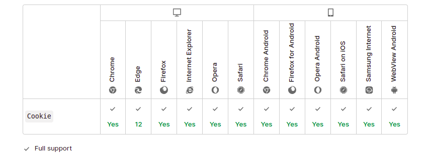

# HTTP cookies

An HTTP cookie (web cookie, browser cookie) is a small piece of data that a server sends to a user's web browser. The browser may store the cookie and send it back to the same server with later requests. Typically, an HTTP cookie is used to tell if two requests come from the same browser—keeping a user logged in, for example. It remembers stateful information for the stateless HTTP protocol.

**_Cookies are mainly used for three purposes:_**

- Session management
  - Logins, shopping carts, game scores, or anything else the server should remember
- Personalization
  - User preferences, themes, and other settings
- Tracking
  - Recording and analyzing user behavior

```go
    http.SetCookie(w &http.Cookie){
        Name: "My-Cookie",
        Value: "Some Value",
    }

```

```go
type Cookie struct {
	Name  string
	Value string

	Path       string    // optional
	Domain     string    // optional
	Expires    time.Time // optional
	RawExpires string    // for reading cookies only

	// MaxAge=0 means no 'Max-Age' attribute specified.
	// MaxAge<0 means delete cookie now, equivalently 'Max-Age: 0'
	// MaxAge>0 means Max-Age attribute present and given in seconds
	MaxAge   int
	Secure   bool
	HttpOnly bool
	SameSite SameSite
	Raw      string
	Unparsed []string // Raw text of unparsed attribute-value pairs
}
```

## Browser compatibility


